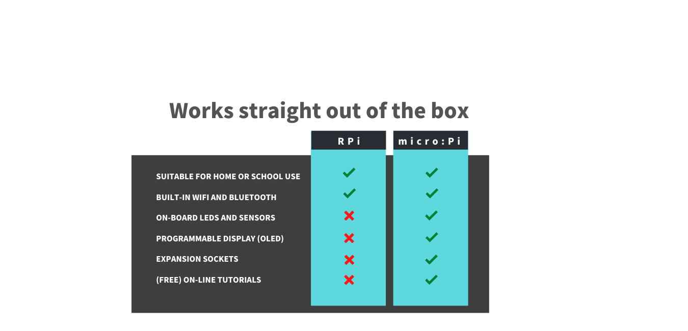

# micro:Pi

The micro:Pi is equipped with on-board sensors and expansion sockets that support external components. There are no messy-wires to connect. It is ideal for building robots, home automation, and computer programming. It comes with the operating pre-installed and it works straight out of the box.

