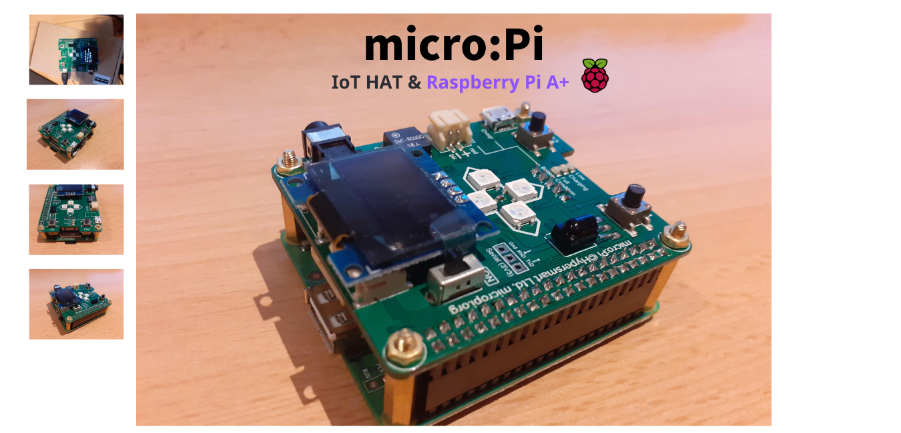
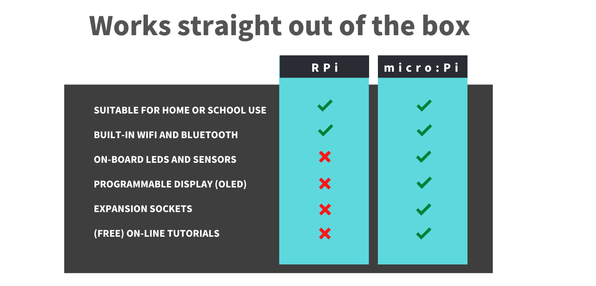

# micro:Pi

The micro:Pi does not have any messy-wires to connect so it is perfect for beginners that want to learn about the 'Internet of Things'. There are FREE online tutorials for building robots, home automation, and computer programming. The operating is pre-installed so it works straight out of the box.

