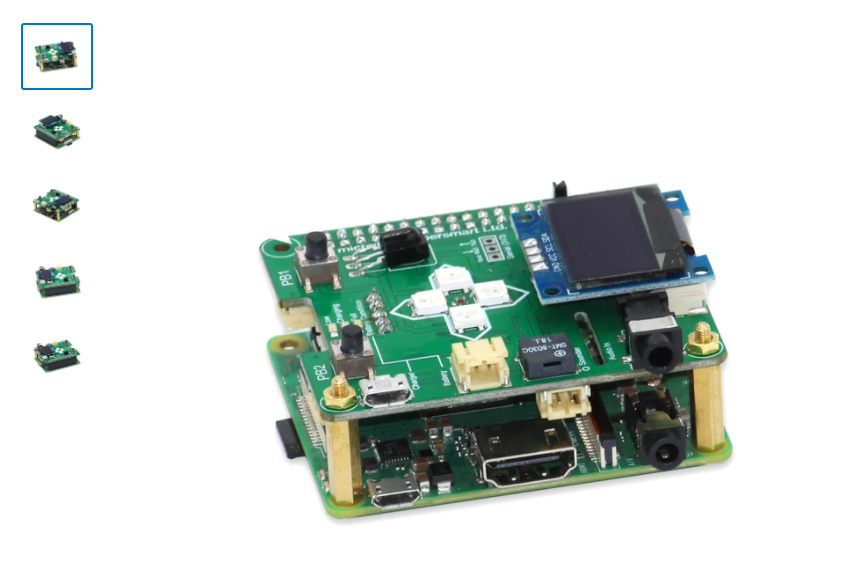

# micro:Pi

The micro:Pi is the ultimate device for developing skills and knowledge about the 'Internet of Things'. It avoids the need for messy wires and instead provides onboard functionality and connectivity. Key features include an 0.96" OLED display, sockets for DC Motors, and I2C Grove compatible interfaces that can support an additional 127 sensors. The operating system is pre-installed so you can start developing right away. There are FREE online tutorials to get you started and an entire remote learning eco-system is being developed at topAcademy.com.

